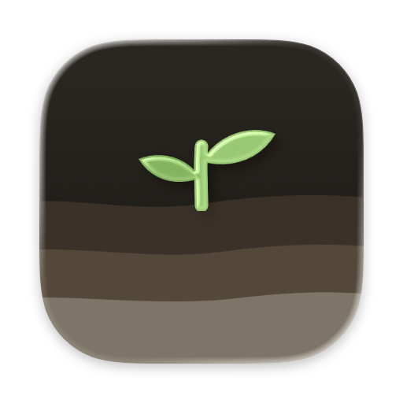
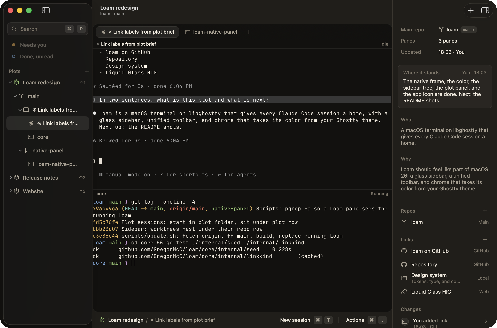
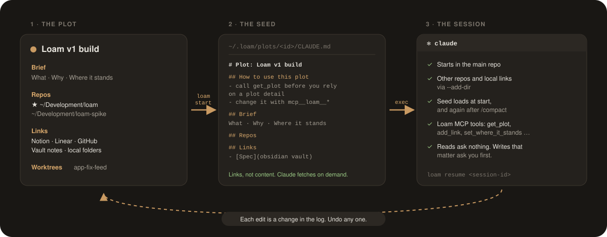
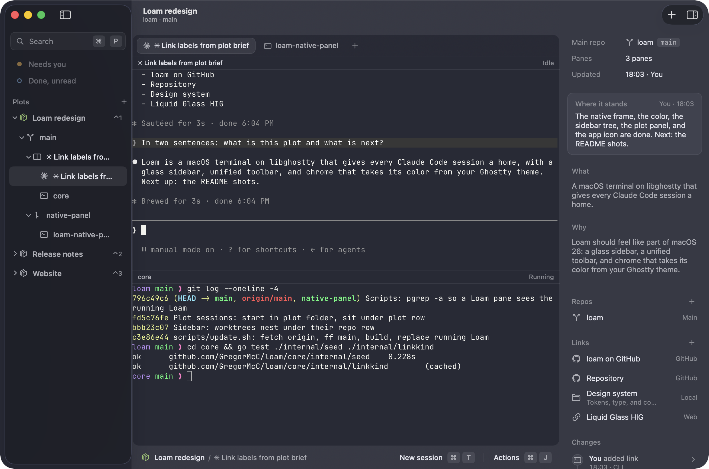
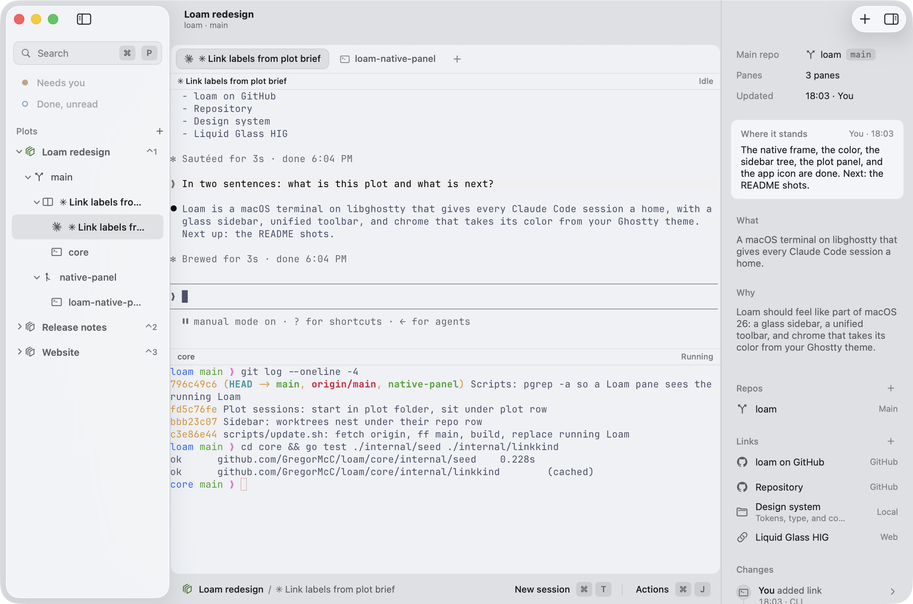
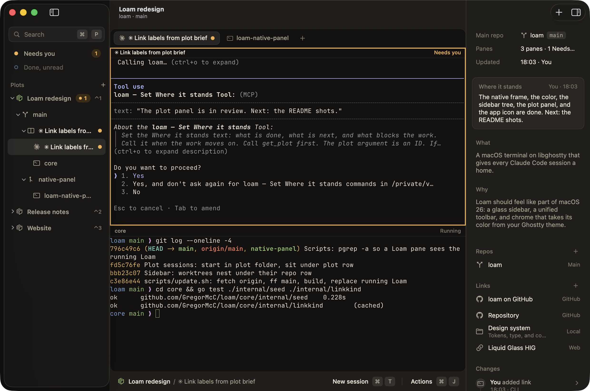
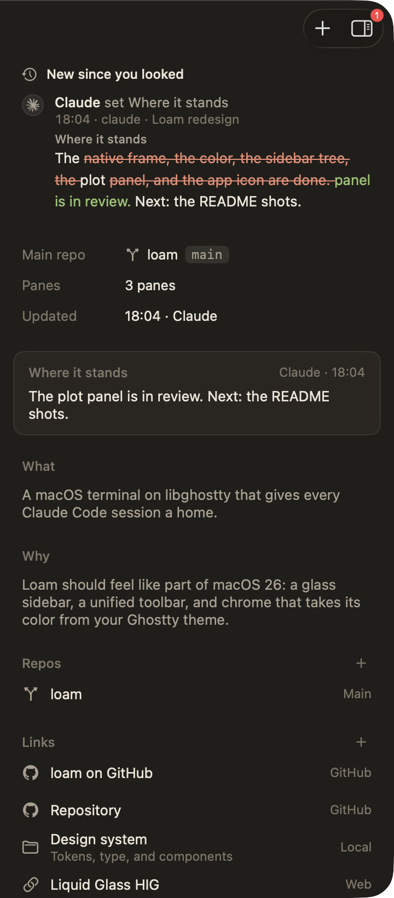
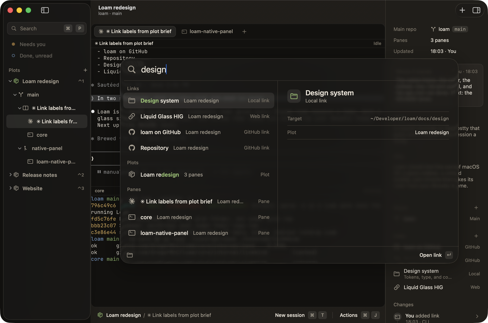
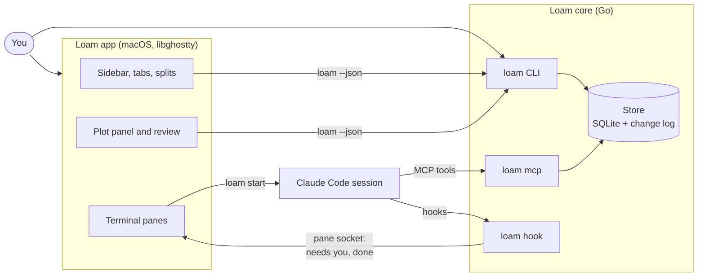

<p align="center">
  
</p>

<h1 align="center">Loam</h1>

<p align="center"><b>A macOS terminal, built on libghostty, that gives every Claude Code session a home.</b></p>

<p align="center">
  <a href="https://gregormcc.github.io/loam/">Website</a> ·
  <a href="#install">Install</a> ·
  <a href="#use-it">Use it</a> ·
  <a href="#how-it-works">How it works</a> ·
  <a href="#the-loam-cli">The loam CLI</a> ·
  <a href="docs/design/README.md">Design system</a>
</p>

<p align="center">
  <picture>
    <source media="(prefers-color-scheme: dark)" srcset="docs/images/hero-night.png">
    <source media="(prefers-color-scheme: light)" srcset="docs/images/hero-day.png">
    
  </picture>
</p>

## Why Loam

A new Claude Code session starts blank. It does not know what the work is, why it matters, or where the key documents are. So you explain it again in each session.

Loam keeps that context in a **plot**: one area of work, with a short brief, the repos it touches, and links to the documents that matter. Each session that Loam starts in a plot gets a **seed** with all of it, from its first message. Claude can keep the plot up to date through Loam's MCP tools. Each edit goes in a change log, and you can undo it.

<p align="center">
  
</p>

## What you get

### Your terminal, in your theme

Loam runs on libghostty, so your Ghostty config applies: the font, the keys, and the theme. The window takes its colours from the terminal theme, and it changes as soon as you reload the config. With no config, Loam uses its own Night and Day themes.

<p align="center">
  
  
</p>

### Every session in its place

The sidebar shows each plot as a tree: each repo, its worktrees under it, and the panes that run in each one. ⌘T starts a seeded Claude Code session in the main repo of the active plot. "New session" on the plot row starts one in the plot folder, with every repo added. A worktree gets its own branch, and Loam runs your setup command in it.

### A signal when a session needs you

A pane whose session waits on you, for example at a permission prompt, turns amber. The sidebar lists it under "Needs you", and its plot shows a count, even when the plot is not on screen. ⌘L takes you to the next pane that needs you. A pane that finished a turn that you have not seen shows a blue ring.

<p align="center">
  
</p>

### Review what Claude changed



The plot panel (⌘I) holds the brief, the repos, and the links, and you can edit all of them. When a session changes the plot, the change shows under "New since you looked", with the diff. The change log keeps every change, and Undo reverses one.

The diff shows the words that Claude removed and added. Read it, then keep the change or undo it.

<br clear="right">

### Go anywhere from the keyboard

The quick switcher (⌘P) finds plots, panes, links, and commands, and shows a preview of the selected one. The actions menu (⌘J) lists the commands for the pane and the plot, with their keys. ⌃1 to ⌃9 go straight to a plot.

<p align="center">
  
</p>

### Your layout comes back

Quit and reopen, and your tabs and splits come back. Each session resumes when you show its plot.

## Install

You need macOS 26 or later on Apple silicon, and Claude Code with `claude` on your PATH.

```sh
curl -fsSL https://raw.githubusercontent.com/GregorMcC/loam/main/scripts/install-release.sh | sh
loam setup                       # once: registers the Loam MCP server with Claude Code
open /Applications/Loam.app
```

- The script downloads the latest release and checks its checksum and its signature. It installs `/Applications/Loam.app` and links `~/.local/bin/loam` to the `loam` CLI inside the app.
- To update, run the same command. If Loam runs, the script quits Loam, installs, and opens it again. You can run it from inside a Loam pane: the pane closes when Loam quits, and the log is `~/Library/Logs/loam-update.log`.
- `loam setup` prints allow rules for the Loam read tools. Add them to `permissions.allow` in your Claude Code settings. Loam does not edit that file.
- A self-signed certificate signs each release. It is not an Apple Developer ID, so Gatekeeper does not know it. `curl` does not mark the download for Gatekeeper, so the app opens. If you download `Loam.zip` with a browser, macOS blocks the first launch. Then open System Settings > Privacy & Security and click Open Anyway.
- To remove Loam, run `curl -fsSL https://raw.githubusercontent.com/GregorMcC/loam/main/scripts/uninstall.sh | sh`.

### Build from source

You need:

- macOS 26 or later
- Xcode 26.5 or later, with the Metal Toolchain: `xcodebuild -downloadComponent MetalToolchain`
- Go 1.26 or later: `brew install go`
- Claude Code, with `claude` on your PATH

```sh
git clone https://github.com/GregorMcC/loam.git
cd loam
scripts/make-signing-cert.sh     # once, if you have no Apple Development certificate
scripts/install.sh app           # builds the loam CLI and /Applications/Loam.app
loam setup                       # once: registers the Loam MCP server with Claude Code
open /Applications/Loam.app
```

- The signing certificate lets macOS keep Loam's folder permissions across updates. `scripts/install.sh app --adhoc` skips it, but then macOS can ask for access again after each update.
- To update, run `scripts/update.sh`. It fetches `origin`, fast-forwards `main`, and builds and installs the new Loam. The checkout must be on `main` with no uncommitted changes. If Loam runs, the script builds first, then quits Loam, installs, and opens it again. You can run it from inside a Loam pane: the pane closes when Loam quits, and the log is `~/Library/Logs/loam-update.log`. To remove Loam, run `scripts/uninstall.sh`.

### Make a release

`scripts/release.sh vX.Y.Z` tags `main`, builds the CLI and the app, and signs both with the "Loam Local Signing" certificate. It publishes `Loam.zip` and its SHA-256 as a GitHub release. `scripts/release.sh vX.Y.Z --dry-run` builds the zip and pushes nothing.

Every release must use the same certificate, because macOS keeps a person's folder permissions only while the signature stays the same. `install-release.sh` refuses an app with another signature. Keep a `.p12` backup of the certificate: in Keychain Access, export "Loam Local Signing".

## Use it

1. Press ⌘N and name the plot.
2. Open the plot panel with ⌘I. Write the brief: what the work is, why it matters, and where it stands.
3. In the panel, add the repos with `+`. The first repo is the main repo, where sessions start. Then add links to the documents that matter.
4. Press ⌘T. Loam starts a Claude Code session in the main repo, seeded with the plot.
5. Work as usual. When a pane turns amber, press ⌘L to go to it.

| Key | Does |
| :- | :- |
| ⌘T | New Claude Code session in the active plot |
| ⌥⌘T | New shell tab |
| ⌘D, ⇧⌘D | Split right, split down |
| ⌃⌘D, ⌃⇧⌘D | Split right with a shell, split down with a shell |
| ⌘P | Quick switcher |
| ⌘J | Actions menu |
| ⌘L | Next pane that needs you |
| ⌃1 to ⌃9 | Go to plot 1 to 9 |
| ⌘N | New plot |
| ⌘B | Show or hide the sidebar |
| ⌘I | Show or hide the plot panel |

The tab and split keys are Ghostty's. If your Ghostty config binds them to other keys, Loam uses yours. The other keys belong to Loam.

## What a plot holds

| Part | What it is |
| :- | :- |
| **Brief** | Three short parts. *What* the work is, *why* it matters, and *where it stands*. What and Why rarely change. Where it stands moves with the work. |
| **Repos** | Local git checkouts. One is the **main repo**, where sessions start. A repo can belong to many plots. |
| **Links** | Labelled pointers to Notion pages, Linear issues, GitHub, Obsidian vault notes, URLs, and local folders. A seed holds the links, never their content. |
| **Worktrees** | Separate checkouts of a repo, each on its own branch, that Loam makes for the plot. |
| **Change log** | Every edit, by you or by a session, with who and when. Undo adds a change. It never removes one. |

## What a session sees

The seed is a `CLAUDE.md` that Loam writes for the plot. It loads when the session starts, and again after `/compact`:

```markdown
# Plot: Loam v1 build

## How to use this plot

- This session belongs to the plot "Loam v1 build". The plot has a brief, repos, and links.
- The plot can change while you work. Before you rely on a plot detail, call `get_plot`.
- To change the plot, use the Loam MCP tools (`mcp__loam__*`), not the `loam` CLI. Loam records each change in the change log.
- When the work moves on, call `set_where_it_stands` with your proposed text.
- A link is a pointer, not content. Fetch a link only when the task needs it, through your own connectors.

## Brief
### What   ...
### Why    ...
### Where it stands   ...

## Repos
- `~/Development/loam`: the Loam repo

## Links
- [ghostty-org/ghostty](https://github.com/ghostty-org/ghostty): the libghostty source
```

## How it works



- **The core works without the app** ([ADR 0002](docs/adr/0002-core-works-without-the-app.md)). Use `loam` in any terminal.
- **The CLI is the contract** ([ADR 0004](docs/adr/0004-go-core-and-the-cli-as-the-contract.md)). The app calls `loam --json` and reads stable exit codes. See [docs/contract.md](docs/contract.md).
- **Seeds hold links, not snapshots** ([ADR 0001](docs/adr/0001-seeds-hold-links-not-snapshots.md)).
- **Sessions start in the main repo** ([ADR 0003](docs/adr/0003-sessions-start-in-the-main-repo.md)).

## The loam CLI

The core works in any terminal, without the app. To install only the CLI, you need Go 1.26 and Claude Code:

```sh
scripts/install.sh core                       # builds loam into ~/.local/bin
loam setup                                    # registers the Loam MCP server with Claude Code

loam new "Loam v1 build"                      # opens the brief in $EDITOR
loam repo add "Loam v1 build" ~/Development/loam
loam link add "Loam v1 build" Spec ~/Notes/Loam/spec.md

loam start "Loam v1 build"                    # a seeded Claude Code session in the main repo
```

| Command | Does |
| :- | :- |
| `loam list` / `loam show <plot>` | See your plots and one plot in full |
| `loam set <plot> where-it-stands "..."` | Move the brief on |
| `loam open <plot> <link>` | Open a link: browser, Obsidian, Finder, or the default app |
| `loam changes` / `loam undo <change-id>` | Review the change log and undo one change |
| `loam worktree new <plot> <repo> <name>` | Make a worktree, then `loam start <plot> --worktree <name>` |
| `loam sessions` / `loam resume <id>` | Find and resume a seeded session |
| `loam archive <plot>` | Put a finished plot away. `loam delete` removes an archived one. |

Each command that prints data takes `--json` for machine-readable output. See [docs/contract.md](docs/contract.md).

## Status

Loam is in daily use. It is a personal project: I fix what I find, and I do not promise a schedule. Releases are on the [releases page](https://github.com/GregorMcC/loam/releases).

## In this repo

```
core/        the Go core: store, CLI, MCP server, seed writer, hooks
app/         the Swift app: LoamKit (models, contract client) and Loam (AppKit, libghostty)
contract/    JSON fixtures and schemas that both sides test against
docs/        the CLI contract, the ADRs, and the design system (docs/design/)
scripts/     install, release, update, uninstall, the app icon, and the GhosttyKit build
site/        the website, deployed to GitHub Pages
```

The vocabulary is in [CONTEXT.md](CONTEXT.md). The decisions are in [docs/adr/](docs/adr/).

## License

MIT. See [LICENSE](LICENSE).

Loam is built on libghostty from [Ghostty](https://ghostty.org), which is under the MIT license. The service marks in the app come from [Simple Icons](https://simpleicons.org) (CC0). Each mark belongs to its owner and only names the linked service.
